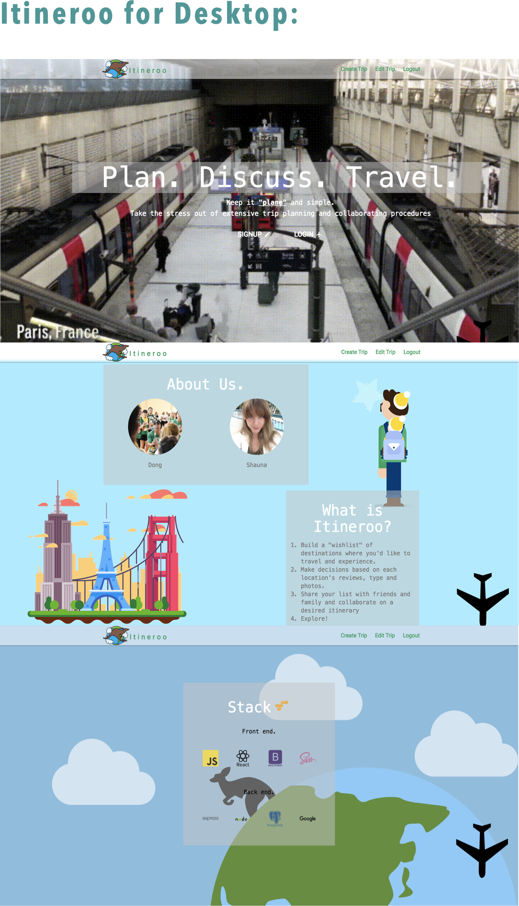
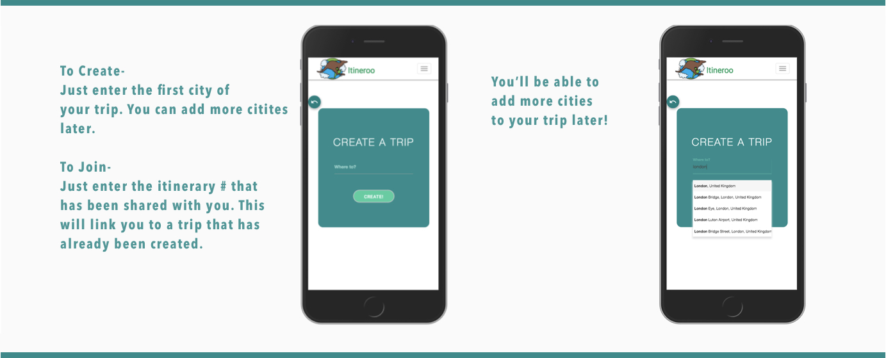
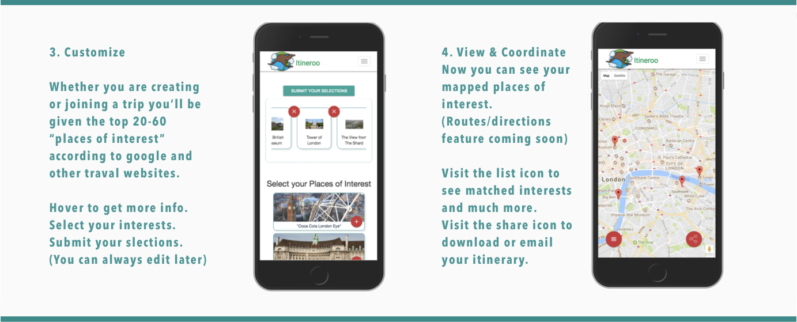
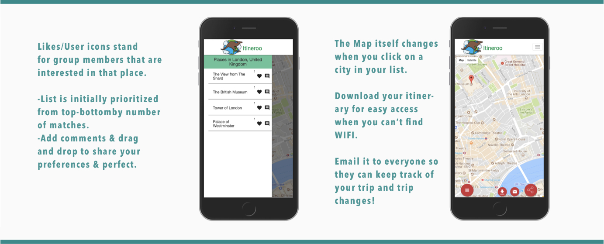

# Itineroo

A trip planning app built to allow friends and family to collaborate, vote and comment on a desired itinerary for any city using Google Places and Google Maps API.

* Front-end built using HTML/CSS/SASS, React, Bootstrap, Materialize, Javascript, AJAX
* Backend was built using Node.js, Express, and PostreSQL,
* Google Places & Maps API was used to fetch top 20 locations from desired city.
* Responsive design to allow usage on both mobile and web.

# Demo
http://itineroo.herokuapp.com/

## Team Members
* Dong Hu
* Shawna Lynn

## Project Screenshots

## Dependencies

* Node 5.10.x or above
* NPM 3.8.x or above
* antd: ^2.11.2,
* axios: ^0.13.1,
* babel-cli: ^6.24.1,
* babel-core: ^6.25.0,
* babel-loader: ^7.0.0,
* babel-plugin-lodash: ^3.2.11,
* babel-preset-es2015: ^6.22.0,
* babel-preset-react: 6.23.0,
* babel-preset-stage-0: 6.22.0,
* babel-preset-stage-2: ^6.24.1,
* bcrypt: ^1.0.2,
* bluebird: ^3.5.0,
* body-parser: ^1.17.2,
* bookshelf: ^0.10.3,
* classnames: ^2.2.5,
* commondir: ^1.0.1,
* css-loader: 0.26.1,
* dotenv: ^4.0.0,
* eslint: 3.15.0,
* eslint-plugin-react: 6.9.0,
* express: ^4.14.0,
* fetch: ^1.1.0,
* flux: ^2.1.1,
* jsonwebtoken: ^7.4.1,
* jwt-decode: ^2.2.0,
* keymirror: ^0.1.1,
* knex: ^0.13.0,
* locate-path: ^2.0.0,
* lodash: ^4.17.4,
* lodash-webpack-plugin: ^0.11.4,
* make-dir: ^1.0.0,
* material: ^0.1.1,
* material-auto-rotating-carousel: ^1.4.1,
* material-ui: ^0.18.6,
* node-fetch: ^1.7.1,
* node-sass: 4.5.0,
* pg: ^6.3.1,
* react: ^15.5.4,
* react-bootstrap: ^0.31.0,
* react-calendar-date-range-picker: ^0.9.6,
* react-dnd: ^2.4.0,
* react-dnd-html5-backend: ^2.4.1,
* react-dom: ^15.5.4,
* react-fontawesome: ^1.6.1,
* react-google-maps: ^7.0.0,
* react-google-maps-loader: ^2.0.3,
* react-google-places-suggest: ^2.1.1,
* react-grid-gallery: ^0.3.6,
* react-hot-loader: ^3.0.0-beta.7,
* react-materialize: ^1.0.1,
* react-redux: 4.3.0,
* react-router: ^4.1.1,
* react-router-dom: ^4.1.1,
* react-rpg: ^2.0.0,
* react-shopping-cart: ^1.6.4,
* react-simple-parallax: ^0.2.6,
* react-springy-parallax: ^1.0.11,
* react-swipeable-views: ^0.12.3,
* react-tap-event-plugin: ^2.0.1,
* react-transition-group: ^1.2.0,
* redux: ^3.0.4,
* redux-logger: ^3.0.6,
* redux-thunk: ^2.2.0,
* sass-loader: 6.0.0,
* shortid: ^2.2.8,
* simple-assign: ^0.1.0,
* sockjs-client: ^1.1.2,
* sortablejs: ^1.6.0,
* style-loader: 0.13.1,
* uglifyjs: ^2.4.10,
* underscore: ^1.8.3,
* url-loader: ^0.5.9,
* validator: ^7.0.0,
* webpack: 2.2.1,
* webpack-dev-server: 2.3.0
